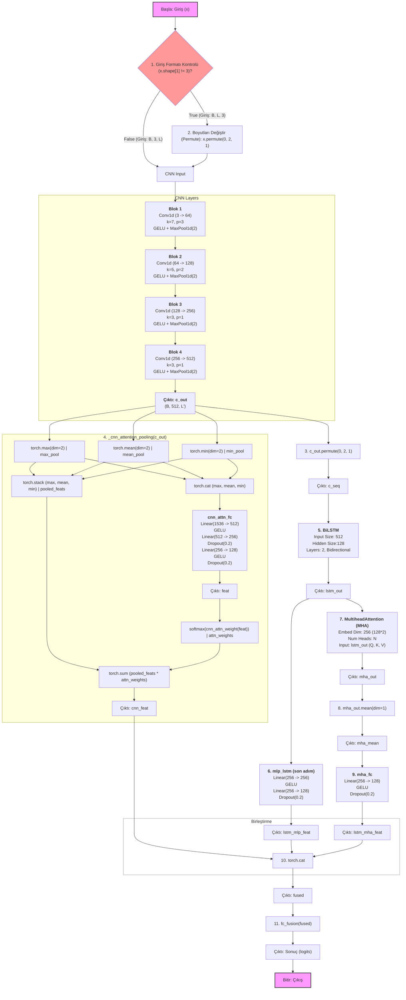

# Model Mimarisi Akış Şeması

Aşağıda `BP_TripleHybrid` modelinin `forward` metodunun görsel bir akışı bulunmaktadır.

```mermaid
flowchart TD
    A["Başla: Giriş (x)"] --> B{"1. Giriş Formatı Kontrolü (x.shape[1] != 3)?"};
    B -- "True (Giriş: B, L, 3)" --> C["2. Boyutları Değiştir (Permute): x.permute(0, 2, 1)"];
    
    B -- "False (Giriş: B, 3, L)" --> D_input["CNN Input"];
    C --> D_input;

    D_input --> E1; 
    
    subgraph CNN Katmanları ["CNN Layers"]
        direction LR  
        
        E1["<b>Blok 1</b><br>Conv1d (3 -> 64)<br>k=7, p=3<br>GELU + MaxPool1d(2)"]
        E2["<b>Blok 2</b><br>Conv1d (64 -> 128)<br>k=5, p=2<br>GELU + MaxPool1d(2)"]
        E3["<b>Blok 3</b><br>Conv1d (128 -> 256)<br>k=3, p=1<br>GELU + MaxPool1d(2)"]
        E4["<b>Blok 4</b><br>Conv1d (256 -> 512)<br>k=3, p=1<br>GELU + MaxPool1d(2)"]
        E_out["<b>Çıktı: c_out</b><br>(B, 512, L')"]
        
        E1 --> E2 --> E3 --> E4 --> E_out;
    end
    
    E_out --> F_op["3. c_out.permute(0, 2, 1)"]
    F_op --> F_out["Çıktı: c_seq"]
    
    
    E_out --> G_max
    E_out --> G_mean
    E_out --> G_min
    
    subgraph CNN Attention Pooling ["4. _cnn_attention_pooling(c_out)"]
        direction TB

        G_max["torch.max(dim=2) | max_pool"]
        G_mean["torch.mean(dim=2) | mean_pool"]
        G_min["torch.min(dim=2) | min_pool"]

        G_max --> G_cat["torch.cat (max, mean, min)"]
        G_mean --> G_cat
        G_min --> G_cat

        G_cat --> G_fc["<b>cnn_attn_fc</b><br>Linear(1536 -> 512)<br>GELU<br>Linear(512 -> 256)<br>Dropout(0.2)<br>Linear(256 -> 128)<br>GELU<br>Dropout(0.2)"]
        G_fc --> G_fc_out["Çıktı: feat"]
        G_fc_out --> G_weights["softmax(cnn_attn_weight(feat)) | attn_weights"]

        
        G_max --> G_stack["torch.stack (max, mean, min) | pooled_feats"]
        G_mean --> G_stack
        G_min --> G_stack
        
        G_stack --> G_weighted_sum["torch.sum (pooled_feats * attn_weights)"]
        G_weights --> G_weighted_sum
        
        G_weighted_sum --> G_end["Çıktı: cnn_feat"]
    end
    
    F_out --> H_op["<b>5. BiLSTM</b><br>Input Size: 512<br>Hidden Size:128 <br>Layers: 2, Bidirectional"]
    H_op --> H_out["Çıktı: lstm_out"]
    

    H_out --> I1_op["<b>6. mlp_lstm (son adım)</b><br>Linear(256 -> 256)<br>GELU<br>Linear(256 -> 128)<br>Dropout(0.2)"]
    I1_op --> I1_out["Çıktı: lstm_mlp_feat"]
    
    H_out --> J_op["<b>7. MultiheadAttention (MHA)</b><br>Embed Dim: 256 (128*2)<br>Num Heads: N<br>Input: lstm_out (Q, K, V)"]
    J_op --> J_out["Çıktı: mha_out"]
    
    J_out --> K["8. mha_out.mean(dim=1)"]
    K --> K_out["Çıktı: mha_mean"] 
    K_out --> L_op["<b>9. mha_fc</b><br>Linear(256 -> 128)<br>GELU<br>Dropout(0.2)"] 
    L_op --> L_out["Çıktı: lstm_mha_feat"]

    subgraph Birleştirme
        G_end --> M["10. torch.cat"]; 
        I1_out --> M["10. torch.cat"]; 
        L_out --> M["10. torch.cat"]; 
    end
    
    M --> M_out["Çıktı: fused"] 
    M_out --> N["11. fc_fusion(fused)"] 
    N --> N_out["Çıktı: Sonuç (logits)"] 
    N_out --> O["Bitir: Çıkış"]; 

    style A fill:#f9f,stroke:#333,stroke-width:2px
    style O fill:#f9f,stroke:#333,stroke-width:2px
    style B fill:#f99
    style Birleştirme fill:transparent,stroke:#999
```
